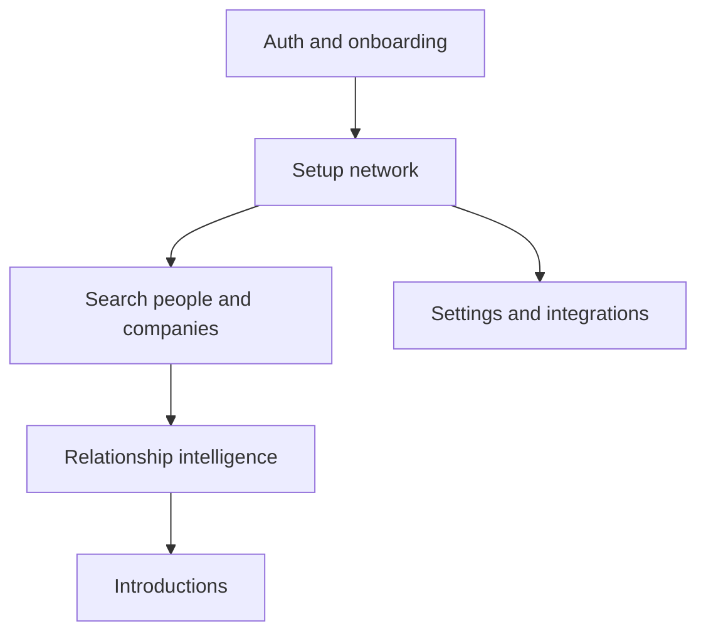

## High-value routes

- `/setup-network`
- `/search/people`
- `/search/companies`
- `/relationship-intelligence`
- `/introductions`
- `/settings/integrations`

The dashboard is where users make decisions. It should stay focused on warm intro workflows and relationship insight, not drift into a generic CRM shell.
