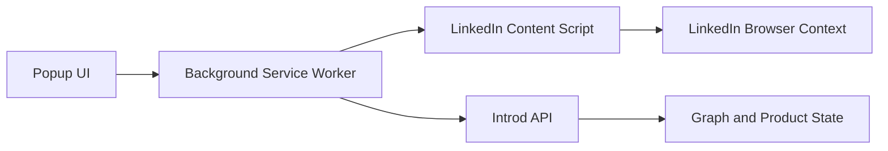

## Components

- popup state and sync controls
- background runtime and messaging
- LinkedIn content script and page diagnostics
- browser-local storage for auth and caches

The extension should remain reliable and narrow enough to pass Chrome Web Store review without claiming unsupported behavior.
