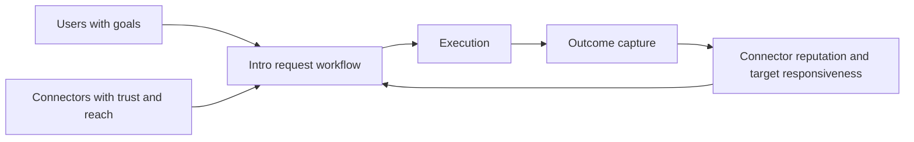

```mermaid
flowchart LR
  A[Users with goals] --> C[Intro request workflow]
  B[Connectors with trust and reach] --> C
  C --> D[Execution]
  D --> E[Outcome capture]
  E --> F[Connector reputation and target responsiveness]
  F --> C
```

## Why it matters

The intro marketplace idea only works if execution data loops back into ranking. Otherwise the product never learns which connectors actually convert.
