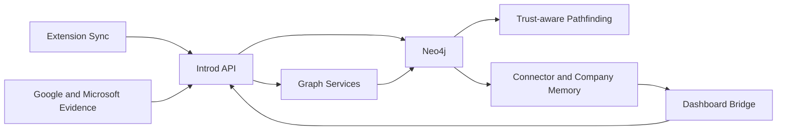

NeoGraph is the relationship substrate behind Introd. It is not a generic social graph browser; it is a tenant-scoped, evidence-backed graph for finding and explaining warm routes.

## Core responsibilities

- store tenant-scoped people, company, and identity nodes
- materialize relationship edges from LinkedIn, email, meetings, shared context, and intro history
- preserve provenance and confidence on every edge
- support pathfinding, TrustRank, graph sharing, and intro outcome intelligence
- feed ranked results back into dashboard and extension experiences

## Active components

| Layer | Files or services |
| --- | --- |
| Graph storage | `server/services/graph/neo4j.ts` and Neo4j |
| Query layer | `server/services/graph/queries.ts` |
| Path scoring | `server/services/graph/pathIntelligence.ts` |
| Sharing and unlocks | `server/services/graph/sharing.ts` |
| Intro marketplace | `server/services/graph/introMarketplaceService.ts` |
| Fallback pathfinding | `server/services/pathFinder.ts` |
| Public graph routes | `server/routes/graphIntel.ts` |

## Design rules

- every graph read must stay user- or workspace-scoped
- every warm route must be explainable
- inferred context can support ranking but not impersonate proof
- graph output should degrade honestly when evidence is weak or Neo4j is unavailable

## What NeoGraph powers

- [TrustRank and confidence](/relationship-intelligence/trustrank-and-confidence)
- [Warm path engine](/architecture/warm-path-engine)
- [Graph APIs](/api/graph-apis)
