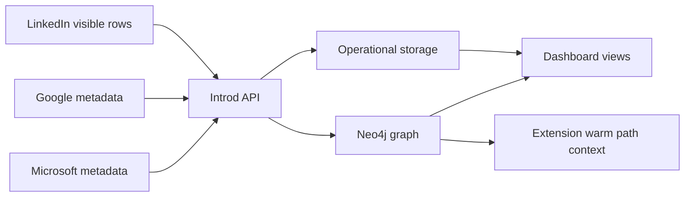

## Pipeline goals

- ingest evidence safely
- keep provider-specific logic out of the user-facing experience where possible
- preserve provenance
- avoid pretending a sync is complete when only partial coverage exists
