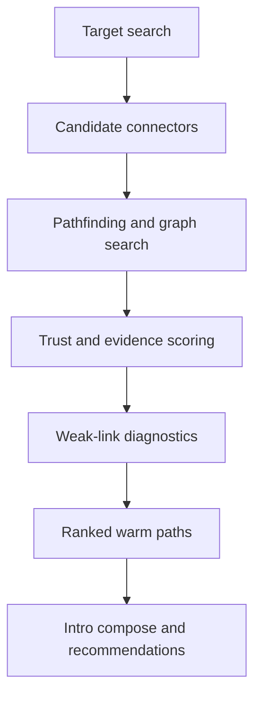

The warm path engine is the decision layer between graph data and intro execution.

## Main inputs

- graph paths from Neo4j
- edge provenance and confidence
- relationship freshness
- email and meeting evidence
- alumni, community, and investor context
- intro outcome history
- connector and target reputation

## Output requirements

Every warm path response should help the user understand:

- why the route exists
- why that connector ranked where they did
- what evidence supports the route
- what is weak or stale
- what to do next

## Current implementation map

| Responsibility | File |
| --- | --- |
| Edge provenance and quality | `server/services/graph/pathIntelligence.ts` |
| User-facing path labels and explanations | `server/services/networkSearchScoring.ts` |
| Fallback pathfinding | `server/services/pathFinder.ts` |
| Connector and target outcome scoring | `server/services/graph/introMarketplaceService.ts` |
| Dashboard graph bridge | `server/routes/dashboardGraphIntelligenceBridge.ts` |

## Ranking principles

The engine should prefer:

- higher-confidence edges
- fresher relationships
- stronger observed interaction
- connectors with better outcome history
- routes with fewer weak links
- clearer explainability

The engine should penalize:

- inferred-only edges
- stale or decaying relationships
- paths with weak connector-target links
- longer routes that do not add trust

## What the user should see

- ranked connector
- intro success score
- graph confidence
- evidence chips
- why-ranked reasons
- weak-link diagnostics
- next recommended action
