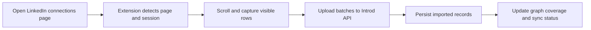

The extension uses LinkedIn as a user-opened, browser-local signal source. It does not operate as a hidden crawler.

## How sync works

## What gets captured

- visible first-degree connection rows
- profile identifiers and URLs
- headline and company context when available
- progress, retry, and pacing diagnostics

## OAuth and callback handling

The manifest includes content scripts for Introd LinkedIn callback routes so the extension can complete browser-local sign-in and bridge flows cleanly.

## Real constraints

- LinkedIn loads large networks incrementally.
- The extension can only import rows that are visible as LinkedIn renders them.
- Large networks can pause because of API pacing or LinkedIn row loading.
- Partial progress is normal and should be shown truthfully.
