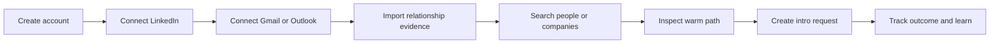

Introd turns relationship evidence into warm introduction workflows. It is designed to help you find the right person, the right connector, and the right moment to ask.

<Columns cols={2}>
  <Card title="Quick start" icon="rocket" href="/getting-started/quickstart">
    Follow the shortest path from sign-up to your first credible warm introduction.
  </Card>
  <Card title="Create account" icon="user-plus" href="/getting-started/create-account">
    Finish sign-in cleanly and move straight into setup instead of landing in an empty workspace.
  </Card>
  <Card title="Connect accounts" icon="mail" href="/getting-started/connect-integrations">
    Add LinkedIn, Gmail, or Outlook so ranking can use real relationship evidence.
  </Card>
  <Card title="Reach the first intro" icon="handshake" href="/getting-started/first-warm-introduction">
    Move from setup into the first warm path and intro request without losing trust in the process.
  </Card>
</Columns>

## What Introd does

Introd combines:

- LinkedIn graph context from the Chrome extension and account connections
- communication and meeting evidence from Google and Microsoft integrations
- operational product state from the dashboard and introduction workflows
- trust-aware graph scoring from the API and Neo4j runtime

The result is a relationship layer that helps users decide:

- who matters
- who can credibly get them in
- which route is strongest right now
- what evidence is missing
- what next action should happen

## How Introd works

## First-use checklist

1. Create an Introd account and complete the sign-in flow.
2. Connect LinkedIn so Introd can start building first-degree graph coverage.
3. Connect Google Workspace or Microsoft 365 to add communication and meeting evidence.
4. Open the dashboard search surfaces and confirm the network has usable coverage.
5. Create your first intro draft from the introductions flow.

## Read next

- [Quick start](/getting-started/quickstart)
- [Create account](/getting-started/create-account)
- [Connect integrations](/getting-started/connect-integrations)
- [First warm introduction](/getting-started/first-warm-introduction)
- [Definitions](/getting-started/definitions)

## For developers and operators

Need the full stack running locally or want the public API details? Head to [Quickstart](/quickstart) and [API Reference](/api).
