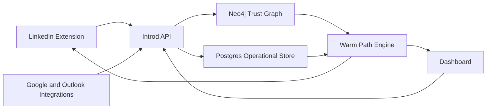

Introd is relationship intelligence infrastructure for warm introduction paths, trust graph workflows, relationship memory, and strategic network insight.

These docs are the source for `docs.getintrod.ai`. They intentionally use Introd `.ai` production domains and do not carry over FoundersNest content.

<Columns cols={3}>
  <Card title="Getting started" icon="rocket" href="/getting-started">
    Connect LinkedIn, add communication evidence, and move from zero coverage to a first credible warm path.
  </Card>
  <Card title="People" icon="users" href="/people">
    Search targets, inspect ranked paths, and move from a promising route into a real introduction request.
  </Card>
  <Card title="Companies" icon="building-2" href="/companies">
    Map target accounts, compare connectors, and understand which companies are actually reachable now.
  </Card>
  <Card title="Relationship intelligence" icon="network" href="/relationship-intelligence">
    Learn how TrustRank, connector ranking, evidence chips, and graph confidence shape each recommendation.
  </Card>
  <Card title="Chrome extension" icon="chrome" href="/chrome-extension">
    Install the LinkedIn extension, understand its permissions, and troubleshoot sync truthfully.
  </Card>
  <Card title="Privacy & security" icon="shield-check" href="/privacy-security">
    Understand data handling, OAuth scopes, deletion workflows, and provider-specific boundaries.
  </Card>
  <Card title="API & platform" icon="blocks" href="/api">
    Review route families, authentication patterns, generated inventories, and local setup for engineering work.
  </Card>
</Columns>

## What Introd helps you decide

<Columns cols={3}>
  <Card title="Who matters" icon="target">
    Focus attention on the people and companies that are worth a warm-intro workflow right now.
  </Card>
  <Card title="Who can get you in" icon="handshake">
    Rank connectors by trust, relationship freshness, and demonstrated ability to move a conversation.
  </Card>
  <Card title="Why the route is credible" icon="shield">
    Show the evidence behind every path instead of hiding weak graph coverage behind confident UI.
  </Card>
</Columns>

## Core workflows

<Tabs>
  <Tab title="Find a person">
    1. Search from the dashboard or people surfaces.
    2. Review the strongest connector and the evidence supporting that route.
    3. Move directly into an intro request when the path is actually worth action.

    Start with [People](/people) and [Introductions](/introductions).
  </Tab>
  <Tab title="Break into a company">
    1. Open a target company and inspect connector density, reachable roles, and company signals.
    2. Resolve the company-level opportunity down to specific people and connectors.
    3. Turn the strongest route into an intro request instead of a generic account note.

    Start with [Companies](/companies) and [Relationship intelligence](/relationship-intelligence).
  </Tab>
  <Tab title="Set up the graph">
    1. Create an account and connect LinkedIn.
    2. Add Google Workspace or Microsoft 365 evidence so ranking can go beyond social adjacency.
    3. Verify graph coverage before trusting any connector recommendation.

    Start with [Getting started](/getting-started) and the [Chrome extension](/chrome-extension).
  </Tab>
</Tabs>

## Product-first docs, with engineering where it belongs

Most of this portal is designed for users, operators, and teams trying to get value from Introd quickly. API references, architecture notes, and local setup live under the separate platform tab so they do not crowd the core product guides.

## Product boundary

Introd should behave like a relationship decision layer, not a generic CRM, scraping product, or LinkedIn utility.

Every recommendation should explain:

- why this person matters
- why this connector is trustworthy
- what evidence supports the route
- what is weak or missing
- what the user should do next

## Core system map

